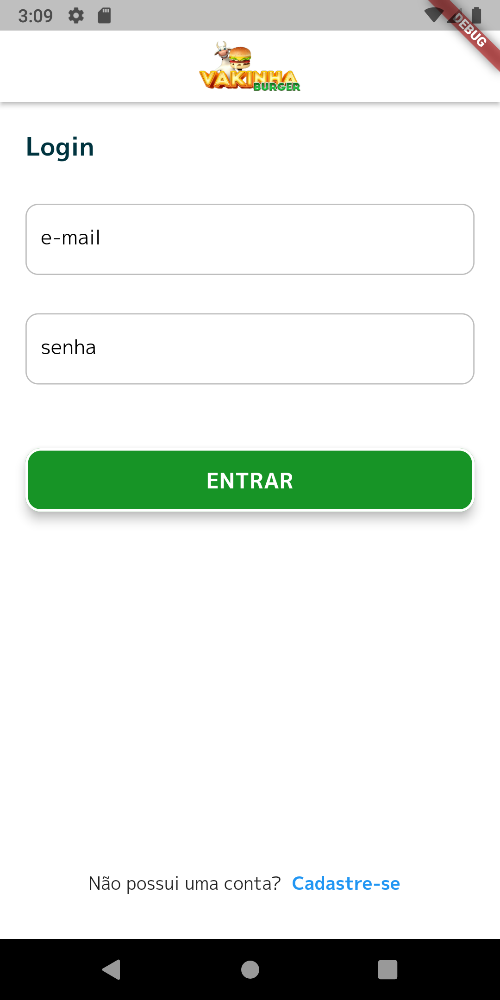
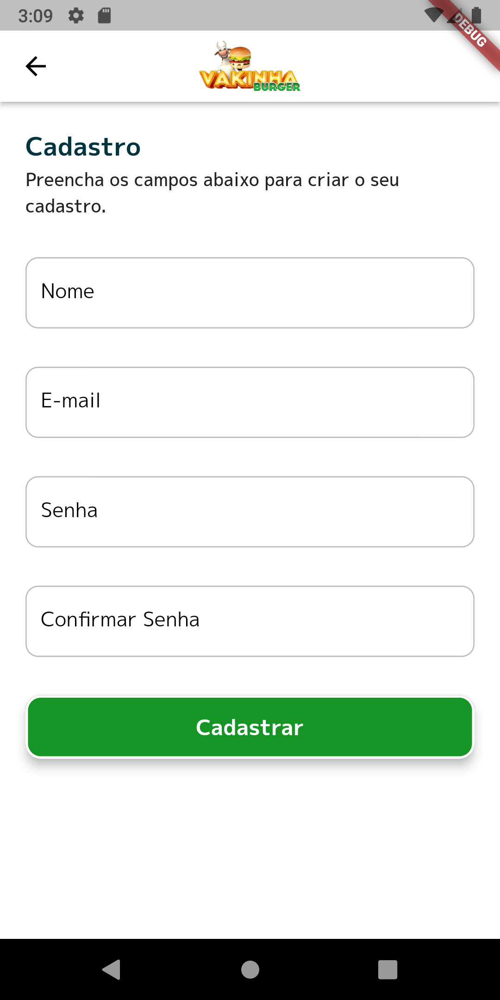
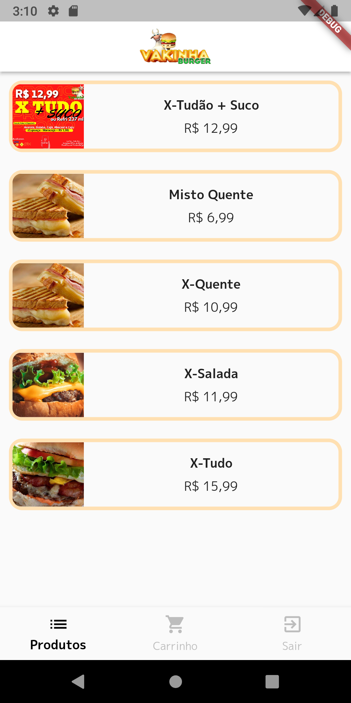
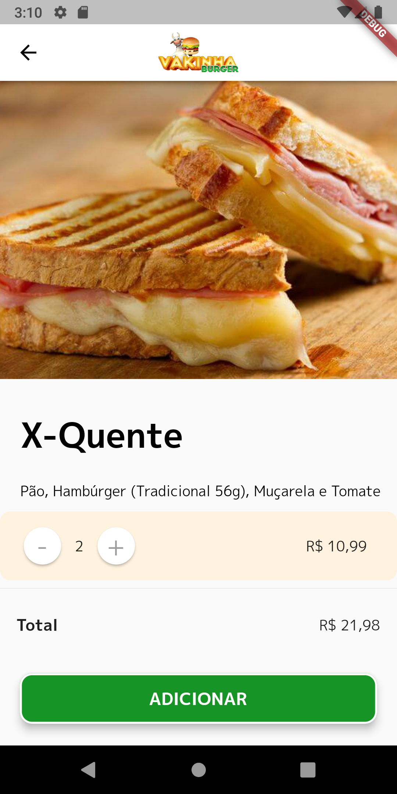
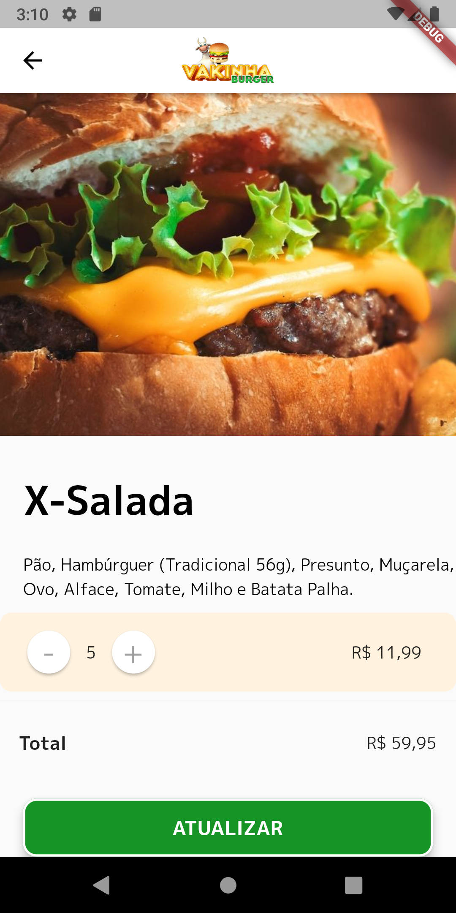
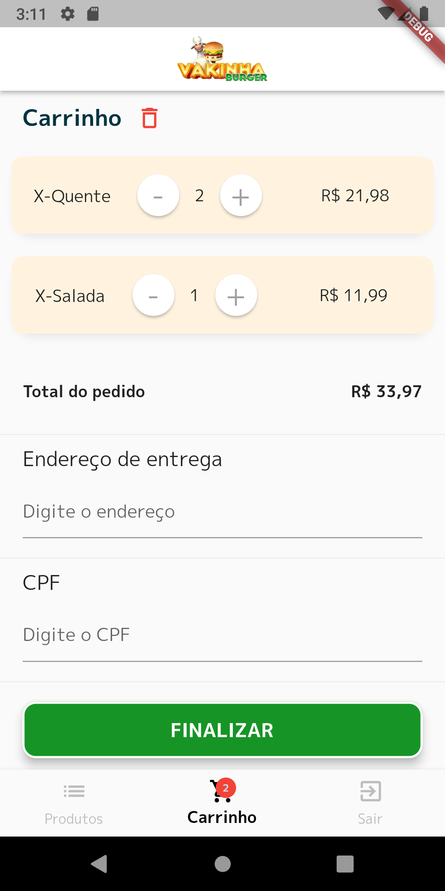

<h1 align="center">Vakinha Burger: </h1>
<h1 align="center">
  </h1>

🚧  Flutter 🚀 Em construção...  🚧

<h1 align="center">
    <a href="https://pub.dev/"> Flutter</a></h1>
	
🚀 Construção de componentes reutilizáveis (Routers, Bindings, Appbar, TextForms, Box, Buttons, Models)...

	

</h4>
 <a href="#Descrição">Descrição</a> •
 <a href="#Experiencia">Experiencia</a> •
 <a href="#Features">Features</a> •
 <a href="#Rodar">Rodar</a> • 
 <a href="#Telas">Telas</a> •  

## Descrição

Projeto desenvolvido em Flutter no evento da Academia do Flutter's Dart Week 02/2022. =>
<a href="http://academiadoflutter.com.br//">Rodrigo Rahman</a>
 

## Experiencia
Com este projeto pude conhecer um caminhão de ferramentas bastante utilizadas nas implementações do Flutter, aprendi mais sobre uma estrutura de projeto organizado e também como realizar o acesso ao BackEnd construido em "shelf" para API do "GerenciaNet.
Segue abaixo mais detalhes de como tudo isso foi explorado.
### Features
- [x] Acesso para novo usuário realizar login 
- [x] Acesso direto a "Produtos" para usuário pré-cadastrado
- [x] Cadastro de novo usuário
- [x] Validação nos campos de preenchimento por todo app
- [x] Compra de produtos e atualização das quantidades
- [x] Navegação via Bottom
- [x] Opção de esvaziar o Carrinho
- [x] Gerenciamento das quantidades também via carrinho de compras
- [x] Método de pagamento via PIX QRCode ou PIX Copia e Cola *"Está funcional, não pague, se pagar vai para conta do Rahman kkk".

### Rodar
- [x] Fazer Clone do Projeto
- [x] Baixar dependencias "Flutter pub get"
- [x] Fazer Build "Flutter run"
### Telas
<h1 align="center">
  
  
  
  
  
    
  
  
  
</h1>

