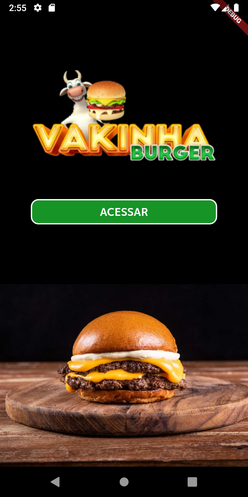

<h1 align="center">Vakinha Burger: </h1>
	🚧  Flutter Select 🚀 Em finalização...  🚧
# Descrição do Projeto

Projeto desenvolvido em Flutter no evento da Academia do Flutter's Dart Week 02/2022.
<a href="http://academiadoflutter.com.br//">Rodrigo Rahman</a>
 

<h1 align="center">
    <a href="https://pub.dev/"> Flutter</a>
	
🚀 Construção com componentes reutilizáveis (Routers, Bindings, Appbar, TextForms, Box, Buttons, Models...)

	

	<h4 align="center"> 

</h4>
 <a href="#Experiencia">Experiencia</a> •
 <a href="#Features">Features</a> •
 <a href="#Telas">Telas</a> •  
 <a href="#Rodar">Rodar</a> • 

## Experiencia
Com este projeto tive a oportunidade de conhecer vários widgets e implementações do Flutter, e também uma estrutura de projeto, com acesso ao BackEnd.
Ainda há muito para explorar neste projeto.
Vakinha Burguer é um aplicativo de delivery de lanches, com pagamento com Pix.

### Features
- [x] Acesso para novo usuário ou acesso direto a usuário pré-cadastrado
- [x] Cadastro de novo usuário
- [x] Validação nos campos de preenchimento por todo app
- [x] Compra de produtos com atualização das quantidades de
- [x] Navegação via Bottom
- [x] Esvaziar Carrinho
- [x] Gerenciamento das quantidades via carrinho de compras
- [x] Método de pagamento via PIX QRCode ou PIX Copia e Cola

### Telas
<h1 align="center">
  
</h1>

### Rodar
- [x] Fazer Clone do Projeto
- [x] Baixar dependencias "Flutter pub get"
- [x] Fazer Build "Flutter run"

